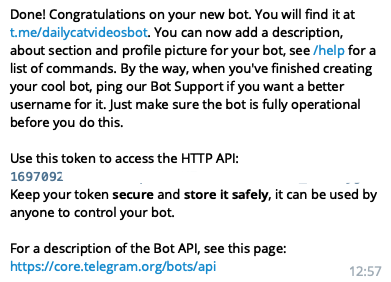
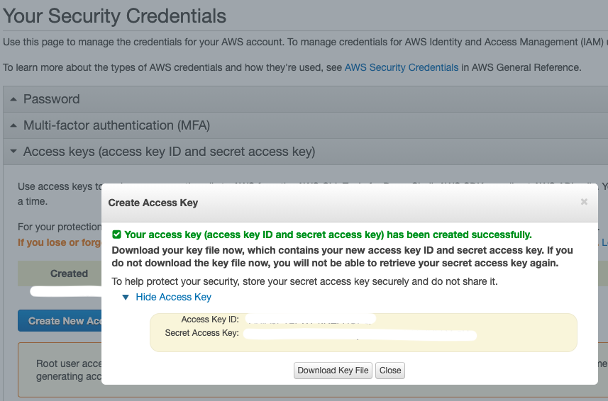
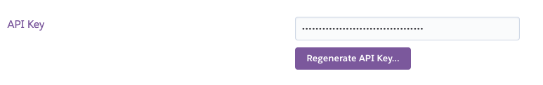
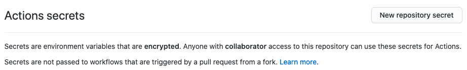
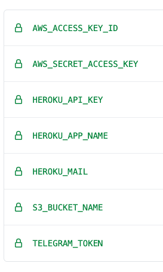

# Daily cat videos

Simple example of a Telegram Bot, with Heroku and AWS integration.

Try me at [t.me/daily-cat-videos](https://t.me/dailycatvideosbot).

# Commands

* `/start`: Quick start guide
* `/latest`: Get latest video
* `/random`: Get random video
* `/subscribe {hour}:{minutes}`: Receive daily updates at specified time
* `/unsubscribe`: Stop daily updates

# How to setup

## Telegram

First, you have to create a bot through [t.me/BotFather](https://t.me/BotFather)

<kbd>
  
</kbd>


Save the TELEGRAM_TOKEN somewhere.

Now, running

```
TOKEN=TELEGRAM_TOKEN python bot_simple.py
```
will run your bot on your local machine, and everything it's already working! Users preferences will get saved in ` subscribed_users.txt`  and the videos will be taken from  ` videos.txt` 

We would like to deploy our bot on a server, so we don't have to have a running job on our local machine.

## Heroku

First things first, you need to setup an account on [Heroku](https:/heroku.com) and install it on your local machine. Please see  [here](https://devcenter.heroku.com/articles/heroku-cli#download-and-install).

Then, open a terminal and type:

```heroku login```

to login in your bash. Initialize your git repo (if you didn't do it already):

```git init```

Then you just need to create an heroku app with:

```heroku create APP_NAME ```

where ` APP_NAME`  will be the name of your app. In case you already have an app name, you can just run

```heroku git:remote -a APP_NAME ```

The generate URL will be something like https://example.herokuapp.com.

Now setup what the Heroku app should do and put it in ` Procfile` . This can be done with:

```echo "web: python3 bot.py" > Procfile ```

Create the ` requirements.txt`  file needed for heroku with:

```pipreqs . ```

(` pip freeze > requirements.txt`  can be also used, but it tends to be cluttered with unwanted packages)

The last thing to do before committing is to tell Heroku our secret variables (telegram token, app name and so on), since our nice bot could end up on git and we don't want that this information will be public! This can be achieved with

```heroku config:set TOKEN=TELEGRAM_TOKEN IS_HEROKU=1 APP_NAME=APP_NAME ```

Now we are ready to deploy our bot!

```
git add .
git commit -m "First commit"
git push heroku main
```

If everything worked correctely, your bot should be running on Heroku. You could check the logs with:

```heroku logs -t ```


## AWS

Why do we need AWS after all? Well, every time that the bot gets reset, we completely lose our info on the user who subscribed to our nice bot! In order to do so, we need to save the info somewhere, and this is where AWS S3 comes into play.

First, you need to create a free account on AWS. Then, generate an API key [here](https://console.aws.amazon.com/iam/home?region=eu-central-1#/security_credentials)

<kbd>
  
</kbd>

Then, [create a bucket](https://s3.console.aws.amazon.com/s3/bucket/create?region=eu-central-1).

This will be the container of any file that your bot needs. Upload an empty ` subscribed_users.txt`  file to your bucket.

We are almost done! Now we just need to tell Heroku to store our ` subscribed_users.txt`  to our bucket.

```heroku config:set AWS_ACCESS_KEY_ID=AWS_ACCESS_KEY_ID AWS_SECRET_ACCESS_KEY=AWS_SECRET_ACCESS_KEY WITH_AWS=1 S3_BUCKET_NAME=S3_BUCKET_NAME ```

where `AWS_ACCESS_KEY_ID` and `AWS_SECRET_ACCESS_KEY` are the keys that you have just obtained and `S3_BUCKET_NAME` is your bucket name.

Enjoy your completely cloud-based Telegram bot!


## Cherry on top: GitHub Actions

If we need to publish our bot on github, the usual commands:

```
git commit -m "message"
git push origin main
```

and then we would push on Heroku with:

```
git push heroku main
```

If we want to sync the GitHub repo with the Heroku one, we can use a GitHub Action. You can find an example in `.github/workflows/heroku_deploy.yml`. The only piece that we miss is an API key from Heroku. This can be obtained [here](https://dashboard.heroku.com/account)

<kbd>
  
</kbd>

save your HEROKU_API_KEY. 

Now we have to add every secret key to the GitHub repo secret. In order to do so, go to [](https://github.com/{USERNAME}/{REPO}/settings/secrets/actions) and define a new secret:

<kbd>
  
</kbd>

In the end, you will have something like this:

<kbd>
  
</kbd>

* `AWS_ACCESS_KEY_ID` and `AWS_SECRET_ACCESS_KEY`: your AWS API keys 
* `HEROKU_API_KEY`: your Heroku API key
* `HEROKU_APP_NAME`: your Heroku app name (just the name, not the URL)
* `HEROKU_MAIL`: your login mail on Heroku
* `S3_BUCKET_NAME`: the AWS S3 bucket name
* `TELEGRAM_TOKEN`: the token provided by BotFather

